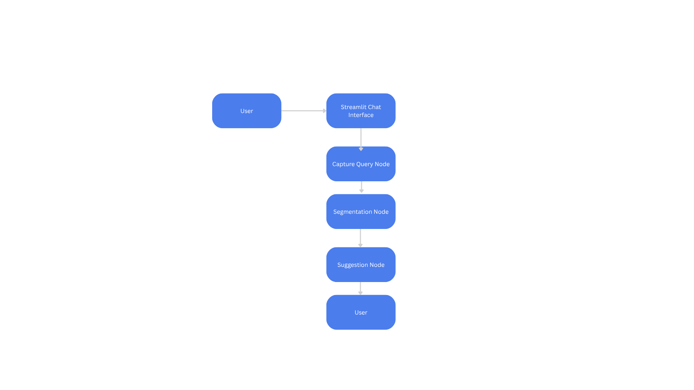

# 🧠 PCI Query Flow with LangGraph

An AI-powered chatbot built with **LangGraph**, **LangChain**, and **Mistral (via Ollama)** that simulates Predictive Customer Intelligence (PCI). The system captures user queries, segments the customer, and generates personalized suggestions using a local LLM.

---

## ✨ Features

- 💬 Conversational chatbot with Streamlit interface
- 🧠 Memory-aware using LangChain memory
- 🧩 Modular LangGraph flow with 3 nodes:
  - `capture_query`: Stores query + retrieves chat history
  - `segment`: Classifies user (e.g., Price-Sensitive, Returning)
  - `suggest`: Generates personalized message using Mistral
- 🔁 Persistent memory per session (supports multi-turn interaction)
- 🧪 Easily testable via local UI or REST endpoints (optional)

---

## 🧱 Project Structure

```
pci-query-flow/
├── .streamlit/
│   └── config.toml
├── app/
│   ├── __init__.py
│   ├── memory.py
│   ├── segmentation.py
│   ├── suggestion.py
│   └── workflow.py
├── diagrams/
│   └── workflow_diagram.png
├── ui/
│   └── streamlit_app.py
├── venv/
│   └── ... (virtual environment files)
├── main.py
├── README.md
└── requirements.txt
```

---

## 🧭 Architecture Diagram



---

## 🚀 Getting Started

### 1. Clone this Repo

```bash
git clone https://github.com/yourusername/pci-query-flow.git
cd pci-query-flow
```

### 2. Set Up Python Environment

```bash
python -m venv venv
source venv/bin/activate  # or venv\Scripts\activate on Windows
pip install -r requirements.txt
```

### 3. Run Mistral via Ollama

Make sure [Ollama](https://ollama.com) is installed and running:

```bash
ollama pull mistral
```

### 4. Launch the Chatbot

```bash
streamlit run ui/streamlit_app.py
```

---

## 🧪 Example Test Prompts

| User Query                 | Segment Inferred   | Sample AI Suggestion                                |
| -------------------------- | ------------------ | --------------------------------------------------- |
| I want a cheap phone       | Price-Sensitive    | "You may like our budget-friendly Galaxy A series." |
| I want to buy again        | Returning Customer | "Welcome back! Can I recommend your last order?"    |
| Do you have any discounts? | Price-Sensitive    | "We have a 20% deal running today!"                 |
| I'm new here               | New Customer       | "Let me walk you through our offerings."            |

---

## 🧠 How It Works

1. **User Message** → captured via Streamlit UI.
2. **LangGraph Flow** triggers:
   - Memory update
   - Context retrieval
   - Customer segmentation
   - AI-generated suggestion using Mistral
3. **Response** is shown in chat + stored in memory for context.

---

## 🛠 Powered By

- [LangGraph](https://github.com/langchain-ai/langgraph)
- [LangChain](https://www.langchain.com/)
- [Mistral](https://mistral.ai/) (via [Ollama](https://ollama.com))
- [Streamlit](https://streamlit.io/)

---

## 📌 Future Improvements

- Integrate with real product data
- Enable REST API access (via FastAPI)
- Add analytics on customer segment trends
- Extend segmentation using embeddings or ML

---

## 📄 License

MIT License — free to use, modify, and distribute.

---

## 👨‍💻 Author

Developed by **Tsewang Norbu Gurung**  
Feel free to contribute or fork!
